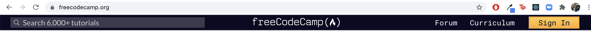
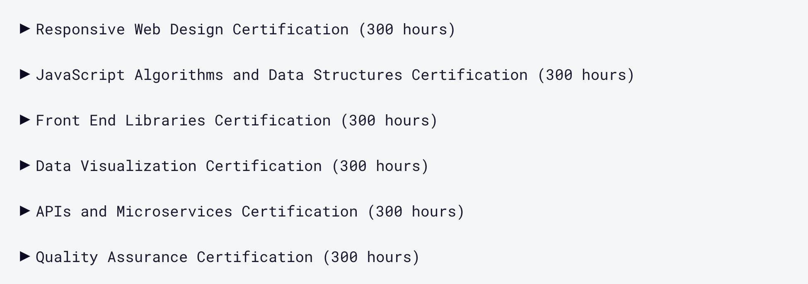
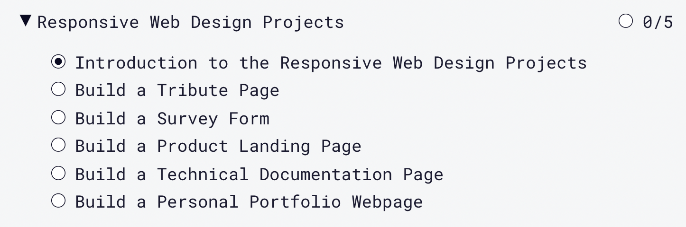

¡Hola familia!

Ni yo mismo me creo que estés leyendo esto. Qué suerte, la tuya.

_...Normalmente no me leo más de 10 línias de los blogs que abro, así que te lo pondré clarito de entrada, para que no te lo saltes:_

**Este blog post es el único que vas a necesitar para aprender a programar webs. Cierra todas las otras pestañas que tienes abiertas y céntrate en esta. Aparta 10 minutos de tu tiempo y presta atención.**

<p align="center">
    
</p>

El 6 de abril de 2020, en pleno confinamiento a causa del covid-19, empecé a estudiar desarrollo web por mi cuenta. No tenía ni idea de HTML, CSS, Javascript o ninguna de las tecnologías que **utilizo a día de hoy en mi puesto de trabajo**.

Después de **4 meses y medio** estudiando por mi cuenta, me contrató la empresa para la que **estoy trabajando actualmente**. Suena bien, ¿eh?

En este post **quiero explicarte, paso a paso, cómo lo hice y cómo puedes hacerlo tú también**.

_...Ahorrándote miles de euros (o la divisa de tu país) en bootcamps o similares._

## ¿Qué vas a necesitar para aprender desarrollo web?

1. Un ordenador (no hace falta que sea muy potente).
2. Conexión a Internet (tampoco hace falta que sea la mejor).
3. Dedicación.

El tercer punto es el más importante. Vas a necesitar dedicación, disciplina y un huevo de horas.

No soy quién para decirte de dónde puedes sacar tiempo para dedicarle al desarrollo web. No conozco el contexto en el que vives. No sé absolutamente nada sobre tí.

Pero lo que tampoco quiero es engañarte. Nadie te va a regalar nada.

**Si no das tu 100% no vas a conseguir convertirte en web developer en menos de 6 meses**.

<p align="center">
    
</p>

_...Por supuesto existirá la excepción que confirme la norma, pero las probabilidades juegan en tu contra._

<h2>Mentalidad web developer</h2>

Bien. Ya nos hemos puesto serios. Ya hemos pasado el *reality check* y estamos listos para darlo todo (o no, pero seguimos leyendo por algún motivo).

Es hora de hablar un poco de *mindset*.

El desarrollo web es una disciplina altamente práctica. No debería sorprenderte. Si aprendes desarrollo, es para desarrollar; hacer cosas. ¿Por qué te cuento esto?

En mis inicios al web dev, leí un comentario en Reddit que decía algo así como:

_"Llevo **estudiando** desarrollo web 4 meses de forma teórica y ahora tengo planeado empezar con mis primeros proyectos [...]."_

<p align="center">
    
</p>

**NO.**

No rotundo a esta actitud.

No te tomes el desarrollo web como algo teórico. Especialmente al empezar.

**Cuando ya sepas desarrollar**, quizás entonces, empieza a dedicar tiempo a **leer sobre cómo desarrollar mejor**.

**Al principio, dedícate a ensuciarte las manos**. Dedícate a equivocarte todo lo que puedas y más. Dedícate a intentar hacer páginas y aplicaciones con lo que sabes y a buscar lo que no sabes de la forma más concreta posible: "html form", "html button", "how to X with javascript".

## ¿Por dónde empezar en esto del web dev?

Hablar de la importancia de la práctica es perfecto para enlazar con el "**por dónde empezar**".

Existe un recurso gratuito espectacular llamado [**freeCodeCamp.org**](https://www.freecodecamp.org).

_Este no será otro de tantos recursos gratuitos. No. Te estoy hablando de **el** recurso._

Primero de todo: te registras.

<p align="center">
    
</p>

Una vez registrado, quiero que te dirijas al [**Curriculum**](https://www.freecodecamp.org/learn). Verás 11 certificaciones (en el momento en el que escribo esta entrada). Nosotros nos vamos a centrar en las 6 primeras.

<p align="center">
    
</p>

_...Yo encontré trabajo a mitad de la sexta certificación. Así que, creeme, es un currículum eficaz._

### Matemáticas rápidas

Saquemos la calculadora:

1. Tenemos 6 certificaciones.
2. Cada certificación son 300 horas (según freeCodeCamp).

```javascript
6 * 300 = 1800 // horas totales
```

3. Supongamos que dedicamos 8 horas al día (una jornada completa). ¿Cuántos días tardaríamos a acabar las certificaciones?

```javascript
1800 / 8 = 225 // días para completar las certificaciones
```

4. Esto, en meses, ¿cuánto es?

```javascript
225 / 30 = 7,5 // meses para completar las certificaciones
```

<p align="center">
    
</p>

_..."Pero, cabrón, me has dicho que se podía hacer en menos de 6 meses."_

**Plot Twist:** No se tarda 300 horas por certificación. **Se puede hacer en menos de 6 meses**.

### ¿Cuánto se tarda, realmente?

Es importante entender que los números que te voy a dar ahora están basados en el tiempo que *yo* tardé. **Tu caso puede ser muy distinto**.

Por otro lado, dejar claro que yo le dediqué un **mínimo de 8 horas al día durante 4 meses y medio**. Sin fines de semana ni vacaciones. Dediqué unas 1080 horas a freeCodeCamp.

_...800 horas menos de lo que debería haber tardado, según freeCodeCamp._

- Responsive Web Design Certification (60 horas)
- Javascript Certification (150 horas)
- Front End Libraries Certification (220 horas)
- Data Visualization Certification (150 horas)
- APIs and Microservices Certification (220 horas)
- Quality Assurance Certification (200 horas)

_Mientras estava estudiando freeCodeCamp, tuve un proyecto freelance al que dediqué 80 horas. Por ese motivo, las certificaciones se quedan 80 horas cortas de mi dedicación total._

<h3>Empieza por el principio</h3>

En el fondo, freeCodeCamp está (o estaba, en el momento de escribir estas líneas) estructurado en este orden:

- HTML
- CSS
- Javascript
- Bootstrap, jQuery, SCSS...
- React
- Redux
- D3.js
- Node.js
- Express
- MongoDB
- Mongoose
- Mocha
- Chai
- Helmet.js

Este es el orden en el que lo han estructurado y **es el orden perfecto**. No pierdas tiempo en cuestionar si es el método óptimo.

_...Nada de lo que hagas será óptimo. Podríamos incluso questionar si óptimo existe. Yo opino que no._

**No pierdas tiempo y esfuerzo en cuestionar si es la mejor ruta**. Es una ruta extremadamente eficiente, que **te va a permitir encontrar trabajo en menos de 6 meses**.

Te pongo unos cuantos ejemplos de rutas que no van a hacer que encuentres trabajo de aquí a 6 meses:

- Buscar por distintos foros cuál es el mejor método para aprender desarrollo web, con la excusa de que empezarás una vez lo hayas descubierto.
- Mirar vídeos de web dev a diestro y siniestro, sin practicar nada de lo que estas mirando y sin ninguna estructura aparente.
- Apuntarte a un bootcamp sin ninguna experiencia previa (sin saber si te gusta -o no- esto del web dev), pagar 5000 € -o más- y esperar a tener la suerte de entrar en la clase en la que hay el buen instructor -que los hay-, que es capaz de enseñarte todo lo que necesitas en 12 semanas.

<p align="center">
    
</p>

_...Incluso si tuvieras suerte en la última opción; te estoy ahorrando 5000 € (o más)._

<h2>Entrega todos los proyectos</h2>

¿Recuerdas que al principio hemos hablado de que el desarrollo web era una disciplina práctica? Bien, pues lo es.

No te limites a hacer las "clases" y *creer* que entiendes los conceptos.

Cada certificación tiene 5 proyectos vinculados a ella. Para obtener la **certificación oficial** de freeCodeCamp, **debes entregar los 5 proyectos**. El funcionamiento de los proyectos está perfectamente explicado en la plataforma, así que no lo haré aquí.

<p align="center">
    
</p>

Los proyectos no deben ser perfectos. No tienes que estar retocando tu *Survey Form* 10 días. No. Tienes que hacer que pasen una serie de validaciones que te permitan obtener la certificación (de nuevo, esto está perfectamente explicado en freeCodeCamp, así que no voy a perder tiempo explicándolo).

## ¿Y ya está? ¿Sigo freeCodeCamp y encontraré trabajo como web developer?

Sí y no. Estoy seguro de que hay gente que únicamente ha necesitado freeCodeCamp para encontrar trabajo. En mi caso, hicieron falta dos cosas más:

1. Udemy
2. Proyectos Personales

_"¡Ah! ¡Te pillé, cabrón! ¡Seguro que ahora quieres venderme tu curso de mierda!"_

No. **Aún** no tengo ningún curso en Udemy. No sé suficiente.

Lo que sí que tengo es una lista de los cursos que yo he comprado:

### Cursos que me han funcionado

#### Básicos

1. [The Modern Javascript Bootcamp Course (2020)](https://www.udemy.com/course/javascript-beginners-complete-tutorial/)
2. [The Complete Node.js Developer Course (3rd Edition)](https://www.udemy.com/course/the-complete-nodejs-developer-course-2/)

#### Avanzados / Opcionales

1. [The Modern Angular Bootcamp [2020]](https://www.udemy.com/course/the-modern-angular-bootcamp/)
2. [Ansible 101 por Jeff Geerling](https://www.youtube.com/watch?v=goclfp6a2IQ&feature=youtu.be&ab_channel=JeffGeerling) (Youtube)


<h3>Cursos que NO me han funcionado</h3>

1. [Angular - The Complete Guide (2021 Edition)](https://www.udemy.com/course/the-complete-guide-to-angular-2/)

No es necesario que te cojas los cursos de Udemy que te acabo de decir. Que te sirva únicamente como referencia por si en algún momento te encallas.

**Insisto:** céntrate en el currículum de freeCodeCamp. Estos cursos deberían servirte para desencallarte (cuando no sepas cómo se hace un proyecto de Javascript, por ejemplo) y/o complementar tu estudio. 

## ¿Me puedo marcar un bailoteo después de cada proyecto?

La respuesta es sí.

<p align="center">
    
</p>

_...Márcate un web developer dance._

## Me he encallado. No sé como resolver un proyecto de desarrollo web.

Tienes varias opciones, pero la primera respuesta siempre es la misma:

- Google.
- Seguir con el curso de Udemy que trate la tecnología de tu problema hasta llegar al concepto que no entiendes **(muy buena opción si lo que te falta es base teórica)**.
- Documentación oficial de la tecnología en cuestión.
- Preguntar en [StackOverflow](https://stackoverflow.com/).
- Preguntar directamente por tu problema en concreto en los [foros de freeCodeCamp](https://forum.freecodecamp.org/). Este punto es extremadamente útil, la comunidad de freeCodeCamp es muy activa, pero asegúrate de haber pasado antes por los puntos anteriores.

_...A nadie le caen bien los cómodos, colega. Intenta sacarte las castañas del fuego antes de pedir a otros que pierdan el tiempo por ti._

Con respecto a **mi caso particular (durante freeCodeCamp)**: 

- Google acostumbra a dar respuesta a todos los problemas relacionados con HTML y CSS de forma bastante-muy rápida.
- Complementé mis días de proyectos de Javascript en freeCodeCamp con el [curso en Udemy](https://www.udemy.com/course/javascript-beginners-complete-tutorial/) (medio día hacía proyecto y medio día miraba vídeos).
- Cuando llegué a los proyectos de React me compré otro curso de Udemy, pero finalmente me ayudó más leerme y releerme la documentación oficial.
- Con respecto a Express, Node, MongoDB, Mongoose, Mocha, Chai y Helmet, lo mismo. Plan lectivo de freeCodeCamp complementado con la documentación oficial de cada tecnología.

Actualmente, cuando tengo una **duda concreta**, ya sea en un proyecto personal o a nivel laboral, lo primero siempre es Google.

**Si no tengo ni puta idea** de la tecnología, lo primero siempre es mirar la **documentación oficial**. Si sigo sin entender la documentación (o si es muy densa y no me apetece estar dos días picando piedra), me busco un buen curso en [Udemy](https://www.udemy.com/).

_...Podría buscarlo en Youtube. Estoy seguro de que podría y de que hay buenos cursos. Pero prefiero pagar 12€ por un curso bien estructurado, que perder una sola hora buscando. ¿Cuánto vale una hora de tu tiempo? Pues eso._

## Ya he acabado los 6 certificados. ¿Ahora, qué?

_...¡Ya está! ¡Ahora a vivir! ¡Haha! ¡Haber estudiao, mindundis!_

<p align="center">
    
</p>

Qué va. Para nada. Ahora toca:

- Por un lado, hacerte el currículum, el portfolio, y empezar a tirar CV como un loco para posiciones de desarrollador júnior.
- Paralelamente, seguir trabajando día a día en proyectos personales que puedan ser interesantes para los *headhunters*.

Pero de eso hablaremos en otras entradas.

¡Muchas gracias por leerme, familia!

Un abrazo y muchos ánimos,

Gerard

